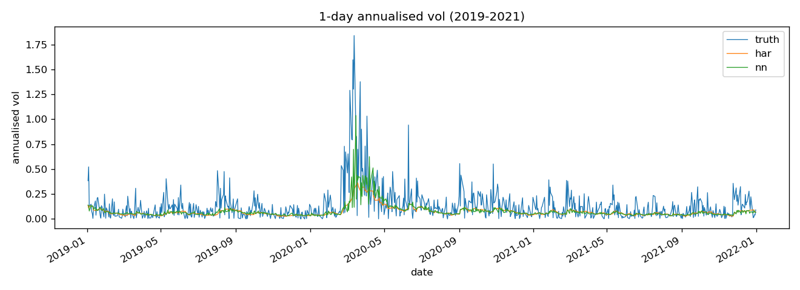
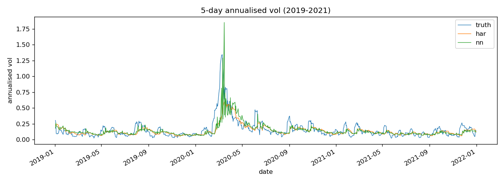

# Neural Network Volatility Forecaster
A Python pipeline for forecasting the realised volatility of SPY, benchmarking a small neural network against the standard volatility models (HAR, GARCH(1,1), EWMA and a naive persistence baseline) under a strict expanding-window walk-forward with Diebold-Mariano significance testing.
Implemented in Python, drawing on stochastic processes and volatility modelling from my BSc in Statistics, Economics and Finance at UCL.

The guiding question is whether a neural network's nonlinearity improves on established linear and recursive models. The project is deliberately built so that an honest negative result is a valid finding: HAR is famously hard to beat, and a rigorous null result is more credible than a fragile claimed win.

## Features

The project includes:
* Realised-volatility targets at one- and five-day horizons, modelled in log-volatility space
* Leakage-controlled features (trailing realised vol over multiple windows, EWMA, return and leverage terms)
* Four benchmark models: naive persistence, EWMA, HAR and GARCH(1,1)
* A 289-parameter PyTorch MLP with target standardisation, weight decay and time-ordered early stopping
* Expanding-window walk-forward evaluation with a boundary-label purge to prevent horizon leakage
* Two scoring losses (log-RMSE and QLIKE) plus Diebold-Mariano tests for statistical significance
* A pytest suite enforcing the no-look-ahead discipline
* Real market data via yfinance

## Models

### Naive (persistence)
The horizon-matched trailing realised volatility, i.e. the most recent realised vol over the same window as the forecast horizon. The simplest horizon-matched persistence benchmark.

### EWMA
RiskMetrics-style exponentially weighted variance:

$$\sigma_t^2 = \lambda\,\sigma_{t-1}^2 + (1-\lambda)\,r_t^2, \qquad \lambda = 0.94$$

### HAR
Heterogeneous Autoregressive model (Corsi, 2009): an OLS regression of forward log realised volatility on its 1-, 5- and 22-day trailing averages.

$$\log \text{RV}_t^{(\text{fwd},h)} = \beta_0 + \beta_1 \log \text{RV}_t^{(1)} + \beta_2 \log \text{RV}_t^{(5)} + \beta_3 \log \text{RV}_t^{(22)} + \varepsilon_t$$

### GARCH(1,1)
Conditional variance with Gaussian innovations, fit by maximum likelihood:

$$\sigma_t^2 = \omega + \alpha\,r_{t-1}^2 + \beta\,\sigma_{t-1}^2$$

### Neural Network (MLP)
A small feed-forward network mapping the seven features to a single log-volatility forecast:

$$x \in \mathbb{R}^{7} \;\rightarrow\; \text{Linear}(7,32) \;\rightarrow\; \text{ReLU} \;\rightarrow\; \text{Dropout}(0.2) \;\rightarrow\; \text{Linear}(32,1)$$

289 trainable parameters in total. Trained with MSE loss on the standardised log-vol target using Adam, weight decay $10^{-4}$, and early stopping on a time-ordered validation slice. The random seed is fixed for reproducibility.

**Features:**

| Feature | Description |
|---------|-------------|
| `log_rv_1`, `log_rv_5`, `log_rv_22`, `log_rv_66` | Log trailing realised volatility over 1, 5, 22 and 66 days |
| `log_ewma` | Log EWMA volatility ($\lambda = 0.94$) |
| `ret_last` | Most recent daily log return |
| `neg_ret_last` | Negative part of the last return (leverage proxy) |

Trailing realised volatility over a window $w$ and the forward target over horizon $h$ are:

$$\text{RV}_t^{(w)} = \sqrt{252}\,\sqrt{\tfrac{1}{w}\textstyle\sum_{i=0}^{w-1} r_{t-i}^2}, \qquad \text{RV}_t^{(\text{fwd},h)} = \sqrt{252}\,\sqrt{\tfrac{1}{h}\textstyle\sum_{i=1}^{h} r_{t+i}^2}$$

Features look strictly backward; targets look strictly forward; the two never share a return.

## Evaluation

Forecasts are produced by an expanding-window walk-forward (initial 750 trading days, refit every 252 days), with every forecast strictly out-of-sample. HAR, GARCH and the network are refit on each fold. The out-of-sample period runs from roughly 2008, spanning the 2008 crisis and the 2020 COVID shock.

**Losses:**

QLIKE, the risk-relevant asymmetric loss (penalises under-forecasting variance), with forecast volatility floored at 1% annualised volatility, equivalent to a variance floor of 0.0001:

$$\text{QLIKE} = \frac{\sigma^2_{\text{true}}}{\sigma^2_{\text{fcst}}} - \log\frac{\sigma^2_{\text{true}}}{\sigma^2_{\text{fcst}}} - 1$$

log-RMSE, the symmetric squared-error loss in log-volatility space.

**Significance:**

The Diebold-Mariano statistic on the loss differential $d_t = L_t^{(\text{nn})} - L_t^{(\text{baseline})}$, with an overlap-adjusted long-run variance estimated using autocovariances through lag $h-1$ to account for multi-step overlap:

$$\text{DM} = \frac{\bar d}{\sqrt{\widehat{\text{LRV}}(\bar d)\,/\,T}}$$

## Example Output

```text
===== horizon: 1 day =====
model        RMSE    QLIKE
naive      2.0258  32.0097
ewma       1.6383   1.7087
har        1.4281   4.5080
nn         1.4371   4.8759
garch      1.6452   1.6508
Diebold-Mariano (NN vs baseline):
  nn vs naive : DM=-6.45  p<0.001
  nn vs ewma  : DM=+15.26  p<0.001
  nn vs har   : DM=+2.20  p=0.028
  nn vs garch : DM=+15.31  p<0.001

===== horizon: 5 day =====
model        RMSE    QLIKE
naive      0.5664   1.0583
ewma       0.5231   0.5186
har        0.4910   0.6184
nn         0.4911   0.6512
garch      0.5205   0.4497
Diebold-Mariano (NN vs baseline):
  nn vs naive : DM=-4.88  p<0.001
  nn vs ewma  : DM=+3.72  p<0.001
  nn vs har   : DM=+1.17  p=0.242
  nn vs garch : DM=+5.12  p<0.001
```





## Key Results

- **The neural network does not beat HAR.** It is significantly worse at the 1-day horizon (DM p = 0.028) and not significantly different at the 5-day horizon (DM p = 0.242, with near-identical RMSE of 0.4911 vs 0.4910). With the same realised-volatility information available to HAR, the added nonlinearity buys nothing, consistent with the well-known difficulty of beating HAR.
- **GARCH wins the risk-relevant loss.** GARCH achieves the lowest QLIKE at both horizons, with EWMA second; the network beats only the naive baseline on QLIKE.
- **RMSE and QLIKE disagree, informatively.** HAR and the network top log-RMSE, consistent with their squared-error estimation objectives, while the recursive variance models (GARCH, EWMA) top QLIKE by reacting faster to volatility spikes and avoiding QLIKE's under-prediction penalty. The "best" model depends on the loss you care about; for risk management, where under-forecasting is the dangerous error, GARCH is the better tool here.
- **Horizon matters.** Under this definition, one-day realised volatility is exactly the annualised absolute value of the following day's return, which is intrinsically noisy; the 5-day horizon is the cleaner target, and the only one where the network is competitive.

## Implementation Notes

- **Log-volatility space**: all volatility features and targets are modelled in log-volatility space, while the return and leverage features remain in daily log-return units. This keeps volatility errors symmetric and guarantees non-negative volatility forecasts.
- **No-look-ahead discipline**: features are strictly backward-looking and targets strictly forward-looking; this is enforced in code and verified by tests that perturb a single return and assert only the correct side of the timeline reacts.
- **Boundary-label purge**: because a forward-$h$ target straddles the train/test split, the last $h-1$ training rows have labels that would not yet be observable at the forecast origin. Training is cut at `start - horizon + 1`, so every training target is fully realised by the forecast date. This affects only the 5-day horizon.
- **QLIKE variance floor**: QLIKE diverges as forecast variance approaches zero and is undefined at exactly zero. Forecasts are therefore floored at 1% annualised volatility, a small floor that prevents zero or near-zero persistence forecasts from numerically dominating the loss. This matters for the 1-day persistence naive, which can emit near-zero forecasts on small-return days.
- **Training stability**: the target is standardised on the inner-training fold (and un-standardised on output), weight decay regularises the network, and early stopping on a held-out time-ordered slice prevents overfitting.

## File Structure

```text
neural-network-volatility-forecaster/
│
├── src/
│   ├── data.py
│   │   └── Price download, log returns, trailing and forward realised volatility.
│   ├── features.py
│   │   └── Leakage-controlled feature and target construction in log-vol space.
│   ├── baselines.py
│   │   └── Naive, EWMA, HAR and GARCH(1,1) benchmark forecasts.
│   ├── model.py
│   │   └── VolMLP, a small PyTorch multilayer perceptron.
│   ├── train.py
│   │   └── Standardisation, early stopping and the neural-network forecast routine.
│   └── evaluate.py
│       └── RMSE, QLIKE, Diebold-Mariano and the walk-forward engine.
│
├── tests/
│   ├── test_data.py
│   │   └── Known-value and no-look-ahead checks on returns and realised vol.
│   └── test_features.py
│       └── Shape and temporal-alignment checks on features and targets.
│
├── main.py
│   └── End-to-end experiment: download, walk-forward, scoring and plots.
│
├── images/
│   └── Forecast plots.
│
├── pyproject.toml
└── README.md
```

## Testing

The pytest suite covers known-value checks on the return and realised-volatility calculations, the shape and integrity of the assembled feature/target panel, and the core no-look-ahead property: perturbing a single return must change only the trailing features at or after that day and only the forward targets before it.

```bash
python -m pytest -q
```

## Validation

- Return, realised-volatility and temporal-alignment calculations are checked against known values and invariance tests in the pytest suite.
- HAR, GARCH and the network are all refit on each walk-forward fold, so no information from the test window enters training.
- Results are reproducible: the network uses a fixed seed, and the baselines are deterministic given the data. (Minor run-to-run drift can occur if yfinance re-adjusts SPY's historical prices between download dates.)

## Technologies

- Python 3
- PyTorch
- NumPy / pandas
- statsmodels (HAR regression)
- arch (GARCH estimation)
- yfinance (market data)
- pytest

## Installation

```bash
pip install -e ".[dev]"
```

## Usage

```bash
python main.py          # runs the full experiment and saves the plots
python -m pytest -q     # runs the test suite
```

## References

- Corsi, F. (2009). A Simple Approximate Long-Memory Model of Realized Volatility. *Journal of Financial Econometrics*, 7(2), 174-196.
- Diebold, F. X. & Mariano, R. S. (1995). Comparing Predictive Accuracy. *Journal of Business & Economic Statistics*, 13(3), 253-263.
- Patton, A. J. (2011). Volatility forecast comparison using imperfect volatility proxies. *Journal of Econometrics*, 160(1), 246-256.
- J.P. Morgan/Reuters (1996). *RiskMetrics Technical Document* (EWMA, $\lambda = 0.94$).